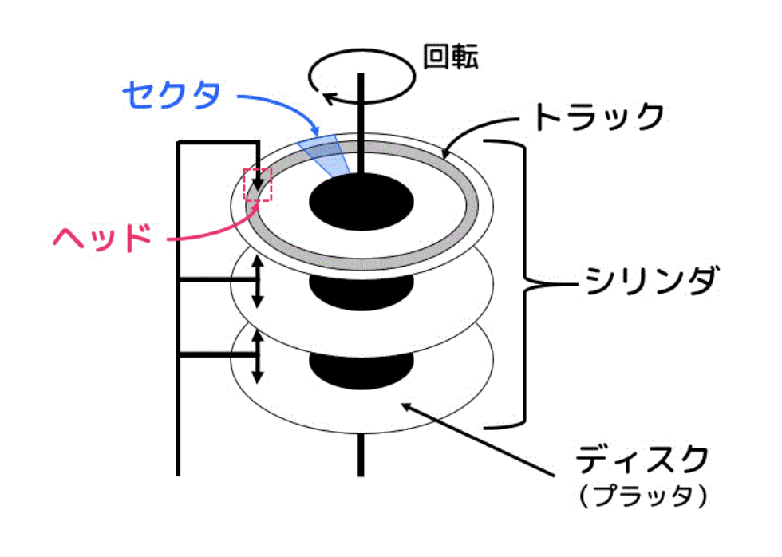

## Summary

## ディスクの仕組み

### **ディスクのアクセス時間**
- **シーク時間**: ヘッドが目的のシリンダに位置付けるために必要な時間。
- **回転待ち時間**: 目的のデータがヘッドの位置に来るまでにかかる時間。
- **データ転送時間**: 実際にデータにアクセスする時間。

ディスクドライブはRAMよりも低速であり、シーク時間（ディスクヘッドが目的のトラックに移動するまでの時間）と回転遅延（目的のトラックの下に移動するまでプラッターが待機する時間）を考慮する必要がある。

### **ディスクの読み込み時間**

### **ディスクキャッシュ**
- **ディスクのメモリーにデータを保存**し、アクセス時間を短縮する。
- **キャッシュがいっぱいになると、古いデータを新しいデータに置換する。**
- **キャッシュヒット**: キャッシュ内にあるデータが要求されると、ディスクアクセス不要で応答可能。（シーク時間と回転待ち時間を0にできる）
- **プリフェッチ**: 要求されたデータだけでなく、関連データを先読みしてキャッシュに保存する技術。

### **シリンダーとは**
- **同じトラック番号を持つプラッタのトラックの集合**。
- **連続データをシリンダーに保存すると、アクセス効率が向上する。**
- **連続したセクターやトラックに再配置すると、さらに効率が良くなる。**

### **ディスクのデータ管理技術**
- **ディスクストライピング**: ディスクを並列使用することで、アクセス速度を向上。
- **ミラーリング**: ディスクの複製を作成し、冗長性を確保。
- **パリティ**: 論理演算を使用してデータの復旧を行う仕組み。

### **ブロックレベルインターフェイス**
- **ディスクマップ**: 空きスペースをマップとして保持し、管理する。
- **フリーリスト**: 空いているブロックをリストで管理し、未使用ブロックは次の未使用ブロックのポインタを保持。

### **ファイルベースインターフェイス**
- **連続割り当て**: ファイルを連続したブロックに格納する。
- **エクステントベースド割り当て**:
  - **エクステントをグループとして管理する方式（エクステントの大きさは可変）**。
  - **連続したブロックのグループを管理する。**
- **インデックス割り当て**:
  - **インデックスブロックを用意して、データの場所を管理する方式。**
  - **個々のブロックを管理しやすい構造。**

### **現実のシステムにおける管理方式**
- **ブロックレベル VS ファイルレベル**
  - **ファイルレベルの方が管理が容易であるため、多くのシステムで採用されている。**
